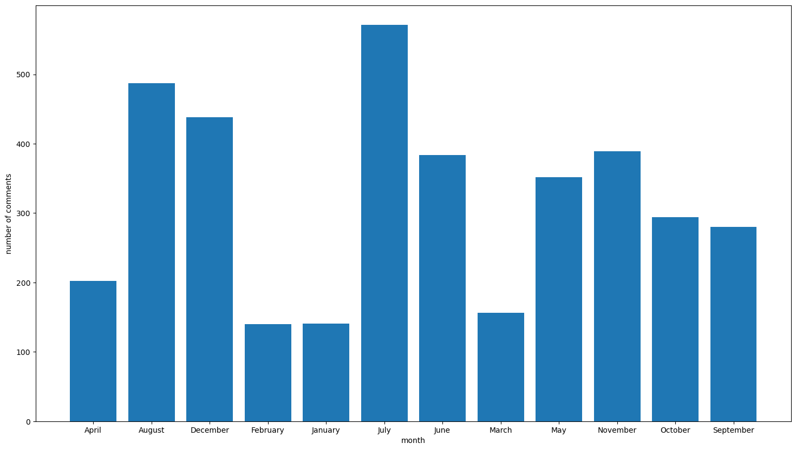
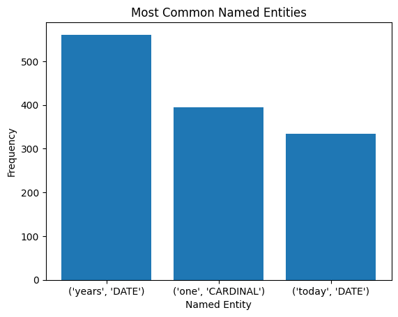

# FINAL REPORT: Conversational AI Chatbot for People Affected by High Inflation and Increased Cost of Living

# A project by the Omdena Lublin Local Chapter.

  

# Executive Summary

'Conversational AI Chatbot for People Affected by High Inflation and Increased Cost of Living', a project by the Omdena Lublin Local Chapter led by chapter leader Chojnacki, lasted 6 weeks and saw the cooperation of an international team of AI engineers. These cooperated steadily to define the problem, collect question-answer pairs and financial information, pre-process and annotate the data, create a ML algorithm for its classification, and eventually deploy and publishing the chatbot in Streamlit. The project run smoothly and was completed successfully.

# Introduction

This challenge was created to create a conversational AI chatbot. Its main aim was to assist people affected by high inflation and increased cost of living. The challenge, which united an international team of AI engineers over 6 weeks, was led by chapter lead Bartosz Chojnacki.

The common language for the chapter was English, and platforms such as GitHub and a dedicated Slack channed were used to coordinate and keep track of the engineers' work.

## Problem statement

Inflation and high living costs have become a problem for the inhabitants of Poland. This problem is especially visible in the poorer parts of the country, such as the Lubelskie Voivodeship, with the city of Lublin, its capital. Current inflation rates indicate its level at 18%, which is the highest rate in 26 years in Poland. Such a high level of inflation causes the reduction of jobs in companies, or even the closure of entire enterprises. Many people have lost their jobs, which until recently was a very rare situation due to the low unemployment rate. This is a new situation for the inhabitants of Lublin, with which not everyone is coping with equally well. Consequently, these people need both financial and mental support.

## Project goal

The goal of this project is to create a virtual chatbot that extracts the expression of mental health states through dialogue-based human-computer interaction to support people who cannot cope in these difficult economic times. The resulting chatbot will also be able to answer any user's questions about the possibility of saving money or depositing it safely.

# Our solution

[…]

##	Domain research

[…]

##	Data collection

[…]

##	Exploratory Data Analysis

[…]

  

  

  

##	Data pre-processing

From the insights of the EDA, we selected different data sources (Myfico, Bogglehead and Quora forums). We completed Data Cleaning with feature selection, drop null rows, drop rows outside of context, and outliers’ question and answer length. All these data sources have been merged into one file. To this file, one copy has been made and then has been applied all the steps for NLP pre-processing. We removed all the punctuation, links, emojis, numbers, and stop words. Then applied tokenization and lemmatization using the module nltk. We kept the original file with all the data merged. We analysed what would be the best approach for different models with processed and unprocessed data.

##	The chatbot

[…]

###	Algorithm selection

[…]

###	Deployment

[…]

##	Publishing

Following the finalization of the chatbot algorithm, an interface was created on the [Streamlit](https://streamlit.io/) platform. Streamlit is an open-source app framework for Machine Learning and Data Science. It helps create and publish web apps in a short time. It is compatible with major Python libraries such as scikit-learn, Keras, PyTorch, SymPy(latex), NumPy, pandas, Matplotlib etc., and it does not require any front-end experience.

Streamlit was selected due to its multifunctionality and ease of usage. It also allows for the model to be hosted online and accessed by its users. For scalability, Flask was considered for integration with the Streamlit-hosted app.

The interface created by our engineers on Streamlit accepts an input from the chatbot user. This input is then sent through the model and an appropriate output is generated and subsequently displayed to the user.

# Conclusions

[…]

# References

[…]

____________________________________________________

This report was written and submitted by Caterina Bonan, Postdoctoral Researcher at the University of Cambridge, who takes full responsibility for any mistake or inaccuracy in it.

____________________________________________________

### Participants (in alphabetical order)
