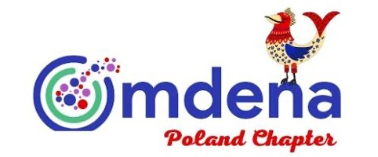

# FINAL REPORT: Conversational AI Chatbot for People Affected by High Inflation and Increased Cost of Living

# A project by the Omdena Lublin Local Chapter.

  

# Executive Summary

[…]

# Introduction

[…]

##	Problem statement

[…]

# Our solution

[…]

##	Domain research

[…]

##	Data collection

[…]

##	Exploratory Data Analysis

[…]

##	Data pre-processing

[…]

##	The chatbot

[…]

###	Algorithm selection

[…]

###	Deployment

[…]

##	Publishing

[…]

# Conclusions

[…]

# References

[…]

____________________________________________________

This report was written and submitted by Caterina Bonan, Postdoctoral Researcher at the University of Cambridge, who takes full responsibility for any mistake or inaccuracy in it.

____________________________________________________

### Participants (in alphabetical order)
