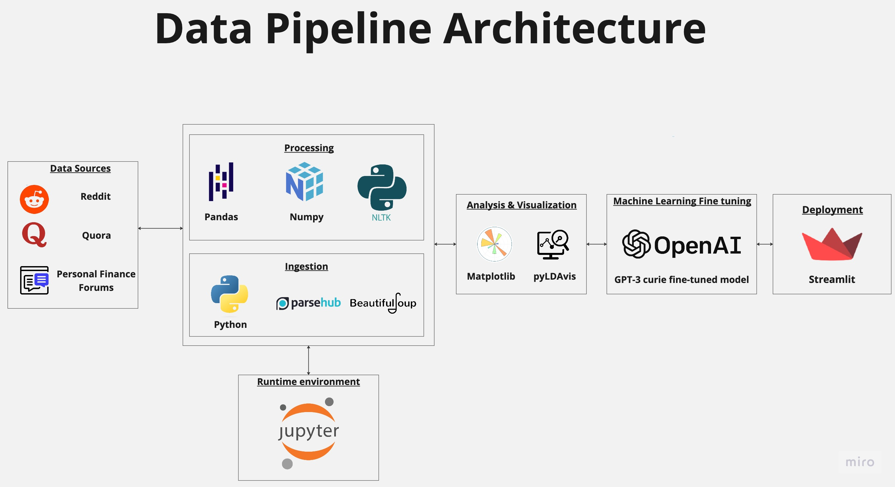

# FINAL REPORT: Conversational AI Chatbot for People Affected by High Inflation and Increased Cost of Living

# A project by the Omdena Lublin Local Chapter.

  

# Executive Summary

'Conversational AI Chatbot for People Affected by High Inflation and Increased Cost of Living', a project by the Omdena Lublin Local Chapter led by chapter leader Bartosz Chojnacki, lasted over 6 weeks and saw the cooperation of an international team of AI engineers. These cooperated steadily to define the problem, collect question-answer pairs and financial information, pre-process and annotate the data, choose a suitable ML algorithm classification, and eventually deploy and publishing the chatbot in Streamlit. The project run smoothly and was completed successfully.

# Introduction

This challenge was created to develop a conversational AI chatbot. The main aim of our proposed solution was to assist people affected by high inflation and increased cost of living. 

The challenge, which united an international team of AI engineers for over 6 weeks, was led by chapter lead Bartosz Chojnacki. The common language for the chapter was English, and platforms such as GitHub and a dedicated Slack channel were used to coordinate and keep track of the engineers' work. The GitHub repository for the project will be made available shortly after the project completion: [https://github.com/OmdenaAI/lublin-poland-inflation-chatbot](https://github.com/OmdenaAI/lublin-poland-inflation-chatbot).

As one of the main goals of Omdena is to promote continuous, high-quality education, thematic workshops organised by leader Chojnacki were delivered to the participants during the project.

## Problem statement

Inflation and high living costs have become a problem for the inhabitants of Poland. This problem is especially visible in the poorer parts of the country, such as the Lubelskie Voivodeship, and in the city of Lublin, the country's capital. 

Current inflation rates have raised at 18%, which is the highest rate in 26 years in Poland. Such a high level of inflation has caused job layoffs, and even the closure of entire enterprises. This is a very rare situation, as the country normally displays low unemployment rate.

Since not everyone in the country is coping with equally well in this situation, our project aimed at providing financial counselling to anyone who might be struggling.

## Project goal

The goal of this project was to create a virtual chatbot that is able to answer any user's questions about the possibility of saving money or depositing it safely, and to support our engineers' continuous learning in the field of NLP and conversational AI.

# Our solution

The team developed a financial chatbot based on the OpenAI ChatGPT-3 `curie` model fine-tuned on the [Financial Opinion Mining and Question Answering](https://sites.google.com/view/fiqa/home) dataset. The chatbot was later deployed as a Streamlit app.

This is the data pipeline architecture for our financial chatbot solution:

To support the participants' learning, a workshop on vectorisation organised by leader Bartosz Chojnacki was delivered by Kacper Łukawski from [Qdrant](https://qdrant.tech/).

##	The data

Given the peculiarity of the task that we wanted out chatbot to perform, we could not only rely on existing language models, and decided to collect financial data to use to fine-tune a language model of our choice later.

The collected data came from a variety of sources (mainly social media). It was done using well-known web-scraping tools such as beautifulsoup, lxml, and selenium. 

###	Data collection

The team scraped question & answer discussions on financial topics from social media such as Reddit, Quora, Facebook, and forums such as Ficoforum and Boglehead. Sławomir Lisowski shared scraping scripts for all of these libraries with the team.

The Reddit files were later discarded because they lacked the answers to the collected questions.

The EDA (selected picture from this stage below) confirmed that the collected data was indeed relevant to our project.

  

###	Data pre-processing

The team, led by task leader Thomas Gervais, performed data cleaning and feature selection. These included, in a first step, dropping null rows and all rows that were outside of context, as well as all outliers. 

All data sources were then merged into one file. One copy of this file was made to apply all necessary steps for NLP pre-processing. Punctuation, links, emojis, numbers, and stop words were removed. Tokenization and lemmatization were performed using the `nltk` library. The original file with all the data merged was kept for record. 

At a later stage, the team nonetheless found issues with the dataset built from the data collected from social networks: many questions/answers were out of context, long sentences were often found instead of clear question-answer pairs. We therefore decided to go back to data collection. 

The team found a good finance Q&A dataset, the [Financial Opinion Mining and Question Answering challenge](https://sites.google.com/view/fiqa/home). This was well-structured and featured coherent Q&A pairs. Light pre-processing was performed to be able to use the data to fine-tune a language model for our chatbot.

##	The chatbot

  

###	Algorithm selection

In this task, the team explored the possibility to train/finetune existing transformers-based language models. The team were initially divided into two teams: one exploring Bert-based models, and the second team exploring GPT3 language models. 

The team eventually opted for the use of GPT-3 language models because all Transformer-based models tested by the team were text classification oriented, meaning that they require context in question-answering tasks. The  dataset we built for the project did not have the required structure and its transformation would have been unnecessarily time consuming.

The GPT-3 language models were thus the best option for our project. Those considered are the following:

  

We started from fine-tuning the `ada` model because it has the lowest cost among all the models that we were considering. However, the results that we obtained were unsatisfactory. We therefore decided to rather work with `curie` as it is a very capable model which, compared to `davinci`, is faster and 10 times cheaper.

The Curie model was trained for 8 epochs on the Financial Q&A dataset. The resulting fine-tuned model, which we owe to Lamia Sekkai, was used within our chat-bot application. Below are two screenshots from preliminary performance tests that were run after 4 fine-tuning epochs.

  

  

The same questions could not be answered by the non-fine-tuned `curie` model, as illustrated below:

  

While this task took longer to complete than we originally forecasted, the team are content with the resulting model's performance and, consequently, the overall performance of the chatbot that resulted from this project.

###	Publishing

Following the finalization of the chatbot algorithm, an interface was created on the [Streamlit](https://streamlit.io/) platform. 

Streamlit is an open-source app framework for Machine Learning and Data Science. It helps create and publish web apps in a short time. It is compatible with major Python libraries such as scikit-learn, Keras, PyTorch, SymPy(latex), NumPy, pandas, Matplotlib etc., and it does not require any front-end experience.

Streamlit was selected due to its multifunctionality and ease of usage. It also allows for the model to be hosted online and accessed by its users. For scalability, Flask was considered for integration with the Streamlit-hosted app.

The interface created by our engineers on Streamlit accepts an input from the chatbot user. This input is then sent through the model and an appropriate output is generated and subsequently displayed to the user.

The team decided to add the Omdena Lublin Local Chapter's logo to the application landing page, as well as the following disclaimer: 'The Content is for informational purposes only, you should not construe any such information or other material as legal, tax, investment, financial, or other advice.'. 

All publishing efforts were guided and coordinated by Vivienne Ordonez.

The chatbot is now publicly available at the following link: [https://omdena-lublin-financial-chatbot.streamlit.app/](https://omdena-lublin-financial-chatbot.streamlit.app/).

# Conclusions

The 'Conversational AI Chatbot for People Affected by High Inflation and Increased Cost of Living' project by the Omdena Lublin Local Chapter was carried out successfully and is now completed. The project constituted a great learning opportunity for many participants, and the resulting chatbot is now available for use to all those who might need financial mentoring in the current economic situation.

____________________________________________________

This report was written and submitted by Caterina Bonan, incoming Services Data Scientist at Five9, who takes full responsibility for any mistake or inaccuracy in it.

The data pipeline architecture was designed by [mohamedawnallah](https://github.com/mhmdawnallah), who takes full responsibility for any mistake or inaccuracy in it.
____________________________________________________

### Participants

Rayan Kiswani

Abayomi Bello

Ahmed Salama

Aim Makarudze

Akash Biswas

Akanksha Sharma

Ananya Choudhary

Efrem Assefa

Bryan  Miranda

Enyinnaya Benjamin Uzuegbu

Mehmet Bertan Ulusoy

Bhaskar Abbireddy

Caterina Bonan

Tatenda Mukonoweshuro

Che-Yu Liu

Gowtham CP

Derek Leckner

Rohit Nair

Fariz  Abdussalam

fathi mhiri

Rose Ann Fuentes

Priya  Gupta 

Garima Kapoor

Daniel Goddard Brookman

Shruti Gupta

Hanshika Gupta

Henok Ademtew

Peter Ibikunle

Irfan Pathan

Juan Castaneda

Jamie Handitye

John Cedric Angeles

Jean Denis

Jeshmitha Gunuganti

Nomin Khishigsuren

kang wang

Kartik Patil

Ketan Mewara

Lydia Khelifa Chibout

Kirollos George

Udit Gagnani

Shivaani  Krishnakumar 

Surabhi Khandare

Lomash Yadav

Lamia Sekkai

Mahrukh Waqar

Mayank Garg

Megha Salimath

Mohamed Awnallah

Mukund shah

Yashwanth Kumar M V

Nabila Tajrin Bristy

Nadiera Mustapha

Navina Ganapathy Amuthan

Neethu Prabhakaran

Minh Huong Ngo

Rodgers Nyangani

David-Daniel Ojebiyi

Omkar Khade

Paban Giri

Vineeth Palani

Pritesh  Kuwar 

Pedro Velazquez

Prashanth Kumar Prashanthkumar

Priya Arora

Promodh Fernando 

Lakshmi Raghavi Devalla

Raul Catacora

Ruan Donino

Shan Lin

Sadhana Savvaser

Samiksha Kolhe

Khushi Sanghrajka

Sayali Bachhav

Sandy Lauguico

Sharvi Endait

Shashank Rathi

Shashwath Punneshetty

Shivam Sunil Bhosale

Shubh Pathak

Siddhesh Pande

Surbhi Rohilla

Slawomir Lisowski

Soha Gad

Hetvi Soni

Sreejith Vidyadharan

Stephanie Creteur

Susan Claudia

Bisma Hilal

Thomas Gervais

Jia Yi Tan

Takashi Nishikawa

Tuyen Truong

Victor Ashioya

Vikas Patil

Vivienne May Ordonez

Weronika Limberger
